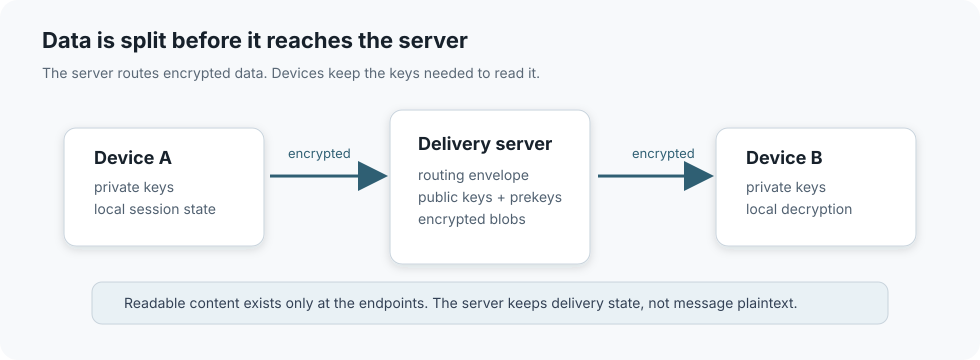

# TellMe

[Russian](README.md) | English

[](https://github.com/Copilot82/TellMe/actions/workflows/rust.yml)
[](https://github.com/Copilot82/TellMe/actions/workflows/ios.yml)
[](https://github.com/Copilot82/TellMe/actions/workflows/docs.yml)
[](https://github.com/Copilot82/TellMe/actions/workflows/codeql.yml)
[](https://github.com/Copilot82/TellMe/actions/workflows/secrets.yml)
[](https://github.com/Copilot82/TellMe/releases)
[](LICENSE)

TellMe is a source base for an organization-operated messenger. The repository provides an iOS
client, Rust backend, PostgreSQL, Redis, S3-compatible object storage, and a STUN/TURN service as a
single deployment unit. An organization runs the server on its own domain and VPS, distributes the
application through its own Apple Developer team, and retains control of accounts, ciphertext, and
infrastructure.

The application implements end-to-end encrypted messages, per-device delivery, encrypted
attachments, and audio/video calls. The backend routes public key material and ciphertext but does
not receive the keys required to decrypt user data.

> [!IMPORTANT]
> This repository is not operated as a public collaboration project. Third-party pull requests,
> issues, integration requests, and support requests are not processed. The source code is provided
> as a technical base for an independently managed corporate deployment.

> [!CAUTION]
> The cryptographic protocol has not undergone an independent audit. A separate review of the
> implementation, infrastructure, and threat model is required before processing critical data.

## Evaluate the application

The public beta is distributed through
[TestFlight](https://testflight.apple.com/join/qP7BxM1e). Until Apple completes TestFlight App
Review, the link may report that no build is available.

Installation requires a compatible physical device running iOS/iPadOS 15 or later, the TestFlight
application, and an Apple Account. TestFlight builds cannot be installed in Simulator.

## Implementation status

The current source version is `2.0.0`.

| Subsystem | Status | Technical boundary |
| --- | --- | --- |
| iOS client | implemented | UIKit, Core Data, Keychain, CryptoKit, CallKit, AVKit |
| Rust backend | implemented | Axum, Tokio, SQLx, PostgreSQL, Redis, MinIO |
| E2E one-to-one messaging | implemented | X3DH-style agreement and Double Ratchet |
| Multiple devices | implemented | device certificates, linking, revocation, per-device fan-out |
| Encrypted media | implemented | client-side encryption and capability-based download |
| Audio and video calls | implemented | WebRTC, CallKit, PiP, short-lived TURN credentials |
| Server federation | implemented | signed server-to-server requests |
| Group conversations | not implemented | requires a separate MLS or sender-keys protocol |
| Independent security audit | not performed | required before critical production use |

## Requirements for a corporate instance

| Area | Required baseline |
| --- | --- |
| Apple | active Apple Developer Program membership, App Store Connect access, unique Bundle IDs, and an APNs key |
| Workstation | a Mac with Xcode 26.2 for the documented reproducible checks |
| Devices | an iPhone or iPad with iOS/iPadOS 15 or later; camera and microphone for calls |
| Domain | a controlled FQDN with an A/AAAA record pointing to the VPS and public TCP `80/443` |
| VPS | 64-bit Ubuntu 24.04 LTS, a static public IP, Docker Engine, and Compose v2 |
| Network | TCP `80`, `443`, `3478`; UDP `3478`, `49152–65535`; outbound TCP `443` for APNs |
| Resources | at least 2 vCPU, 4 GB RAM, and 30 GB SSD; 4 vCPU and 8 GB RAM recommended |

The [requirements matrix](docs/requirements.en.md) also covers DNS, Apple permissions, storage,
and NAT constraints. The [production deployment guide](docs/deployment.en.md) starts from a clean
VPS and ends with an acceptance-tested installation.

## Local backend

The local environment is intended for API development and verification. It does not provide
public TLS, production APNs, or an Internet-accessible TURN relay.

Install Git and either Docker Desktop or Docker Engine with Compose v2. The host needs at least
4 GB of available RAM, 10 GB of disk space, and free ports `3100`, `5432`, `6379`, `9000`, and
`9001`.

```bash
git clone https://github.com/Copilot82/TellMe.git
cd TellMe
cp .env.example .env
docker compose -f compose.dev.yml up -d --build
docker compose -f compose.dev.yml ps
curl --fail http://localhost:3100/health
curl --fail http://localhost:3100/api/config
```

In a correctly started environment, all four services report `Up`, and `/health` returns JSON with
`"status":"ok"`. Follow the backend logs with:

```bash
docker compose -f compose.dev.yml logs -f server
```

Stop the environment without removing the database and object storage:

```bash
docker compose -f compose.dev.yml down
```

Port-conflict diagnostics, a full reset, and running Rust outside Docker are covered in the
[local development guide](docs/local-development.en.md).

## Production deployment

Do not reuse `.env.example` in production. A public instance uses the separate
`compose.production.yml` contract:

```bash
bash scripts/bootstrap-production-env.sh
# Edit .env.production: domain, TURN addresses, and APNs settings.
bash scripts/validate-production-config.sh
docker compose --env-file .env.production -f compose.production.yml up -d --build
```

These commands are an outline only. DNS, the firewall, Apple identifiers, an APNs key, and iOS
endpoints must be configured before startup. The complete sequence, success criteria, and rollback
procedure are documented in [docs/deployment.en.md](docs/deployment.en.md).

## Architecture



| Layer | Contents | Readable by |
| --- | --- | --- |
| Routing envelope | delivery address, device ID, TTL, delivery ID | backend |
| Encrypted payload | messages, attachments, call signaling | participant devices |
| Local key state | identity/device keys, ratchet state, media keys | local device |

The backend stores public key material, ciphertext mailboxes, and minimal routing metadata.
Plaintext conversation state and private keys remain on the devices. See the
[architecture](docs/architecture.en.md), [threat model](docs/threat-model.en.md), and
[protocol](docs/protocol.en.md) documents for the complete design.

## Verification

```bash
cd backend-rust
cargo fmt --all -- --check
cargo clippy --workspace --all-targets --locked -- -D warnings
cargo test --workspace --locked
cargo audit
cargo deny check
```

```bash
xcodebuild test \
  -project messenger/messenger.xcodeproj \
  -scheme messenger \
  -configuration Debug \
  -destination 'platform=iOS Simulator,name=iPhone 17,OS=26.2' \
  -only-testing:messengerTests
```

At the time of release preparation, the backend contains 220 unit tests and the primary XCTest
suite contains more than 300 client tests. CI also runs headless E2E checks, a Compose smoke test,
dependency policy checks, CodeQL, Gitleaks, and a strict documentation build. The purpose and
boundaries of each layer are specified in the [testing strategy](docs/testing.en.md).

## Documentation

The complete English documentation is published on
[GitHub Pages](https://copilot82.github.io/TellMe/en/).

- [Technical documentation index](docs/README.en.md)
- [Infrastructure and Apple requirements](docs/requirements.en.md)
- [Corporate instance deployment](docs/deployment.en.md)
- [iOS and Apple Developer configuration](docs/apple-setup.en.md)
- [Installation verification](docs/deployment-verification.en.md)
- [Backup and restore](docs/backup-and-restore.en.md)
- [Troubleshooting](docs/troubleshooting.en.md)
- [Architecture](docs/architecture.en.md)
- [Threat model](docs/threat-model.en.md)
- [Protocol](docs/protocol.en.md)
- [HTTP and WebSocket API](docs/api.en.md)
- [Testing strategy](docs/testing.en.md)
- [Architecture decision records](docs/adr/README.en.md)
- [Security policy](SECURITY.en.md)
- [Changelog](CHANGELOG.en.md)

The documentation is built in strict mode and published through GitHub Pages. If a document and
the implementation disagree, the source code and automated contract tests take precedence.

## License

The source code is distributed under the [MIT License](LICENSE). The license does not include
technical support, a security audit, or a warranty of fitness for a particular organization.
