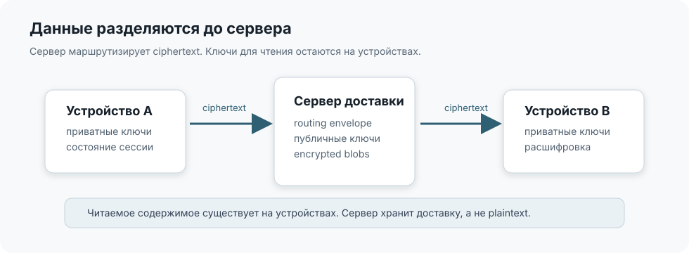

# TellMe

[English](README.en.md) | Русский

[](https://github.com/Copilot82/TellMe/actions/workflows/rust.yml)
[](https://github.com/Copilot82/TellMe/actions/workflows/ios.yml)
[](https://github.com/Copilot82/TellMe/actions/workflows/docs.yml)
[](https://github.com/Copilot82/TellMe/actions/workflows/codeql.yml)
[](https://github.com/Copilot82/TellMe/actions/workflows/secrets.yml)
[](https://github.com/Copilot82/TellMe/releases)
[](LICENSE)

TellMe — основа для собственного корпоративного мессенджера: iOS-клиент, Rust backend,
PostgreSQL, Redis, S3-совместимое хранилище и STUN/TURN-контур поставляются в одном репозитории.
Компания разворачивает сервер на своём домене и VPS, выпускает приложение под собственным Apple
Developer Team и самостоятельно контролирует учётные записи, ciphertext и инфраструктуру.

Приложение поддерживает end-to-end шифрование сообщений, отдельную доставку на каждое устройство,
зашифрованные вложения, аудио- и видеозвонки. Backend маршрутизирует публичный ключевой материал и
ciphertext, но не получает ключи, необходимые для расшифрования пользовательских данных.

> [!IMPORTANT]
> Репозиторий не используется как публичная площадка совместной разработки. Внешние pull request,
> issues, запросы на внедрение и техническую поддержку не рассматриваются. Исходный код
> предоставляется как техническая база для самостоятельного корпоративного развёртывания.

> [!CAUTION]
> Криптографический протокол не проходил независимый аудит. Перед использованием для критичных
> данных требуется отдельная проверка реализации, инфраструктуры и модели угроз.

## Проверить приложение

Открытая beta распространяется через
[TestFlight](https://testflight.apple.com/join/qP7BxM1e). Ссылка уже указана в репозитории, но до
завершения Apple TestFlight App Review может сообщать, что сборка недоступна.

Для установки нужны совместимое физическое устройство, iOS/iPadOS 15 или новее, приложение
TestFlight и Apple Account. Simulator не поддерживает установку TestFlight-сборок.

## Состояние реализации

Текущая версия исходного кода — `2.0.0`.

| Подсистема | Состояние | Техническая граница |
| --- | --- | --- |
| iOS-клиент | реализован | UIKit, Core Data, Keychain, CryptoKit, CallKit, AVKit |
| Rust backend | реализован | Axum, Tokio, SQLx, PostgreSQL, Redis, MinIO |
| E2E 1:1 messaging | реализован | X3DH-подобное согласование и Double Ratchet |
| Multi-device | реализован | device certificates, linking, revoke, per-device fanout |
| Encrypted media | реализован | локальное шифрование и capability download |
| Аудио- и видеозвонки | реализован | WebRTC, CallKit, PiP, краткоживущие TURN credentials |
| Федерация серверов | реализован | подписанные server-to-server запросы |
| Групповые чаты | не реализованы | необходим отдельный MLS или sender-keys протокол |
| Независимый security audit | не проводился | обязательный этап перед критичным production |

## Что требуется для собственного экземпляра

| Область | Обязательный минимум |
| --- | --- |
| Apple | активное членство Apple Developer Program, доступ к App Store Connect, уникальные Bundle ID и APNs key |
| Рабочая станция | Mac с Xcode 26.2 для воспроизводимости опубликованных проверок |
| Устройства | iPhone или iPad с iOS/iPadOS 15+, для звонков — камера и микрофон |
| Домен | управляемый FQDN с A/AAAA-записью на VPS и доступными TCP `80/443` |
| VPS | 64-bit Ubuntu 24.04 LTS, публичный статический IP, Docker Engine и Compose v2 |
| Сеть | TCP `80`, `443`, `3478`; UDP `3478`, `49152–65535`; исходящий TCP `443` для APNs |
| Ресурсы | минимум 2 vCPU, 4 ГБ RAM и 30 ГБ SSD; для рабочего контура рекомендуется 4 vCPU/8 ГБ RAM |

Полная матрица, включая DNS, права Apple, дисковое пространство и ограничения NAT:
[требования](docs/requirements.md). Пошаговое развёртывание с чистого VPS:
[корпоративная установка](docs/deployment.md).

## Локальный запуск backend

Локальный контур предназначен для разработки и проверки API. Он не включает публичный TLS,
рабочий APNs и доступный из интернета TURN relay.

Предварительно установите Git и Docker Desktop либо Docker Engine с Compose v2. Требуется не менее
4 ГБ свободной RAM, 10 ГБ диска и свободные порты `3100`, `5432`, `6379`, `9000`, `9001`.

```bash
git clone https://github.com/Copilot82/TellMe.git
cd TellMe
cp .env.example .env
docker compose -f compose.dev.yml up -d --build
docker compose -f compose.dev.yml ps
curl --fail http://localhost:3100/health
curl --fail http://localhost:3100/api/config
```

В корректно запущенном контуре все четыре сервиса имеют состояние `Up`, а `/health` возвращает
JSON с `"status":"ok"`. Логи backend:

```bash
docker compose -f compose.dev.yml logs -f server
```

Остановка без удаления базы и объектов:

```bash
docker compose -f compose.dev.yml down
```

Диагностика конфликтов портов, полный сброс и запуск Rust без контейнера описаны в
[руководстве локальной разработки](docs/local-development.md).

## Production-развёртывание

Не переносите `.env.example` в production. Для публичного экземпляра используется отдельный
контракт `compose.production.yml`:

```bash
bash scripts/bootstrap-production-env.sh
# Отредактировать .env.production: домен, адреса TURN и APNs.
bash scripts/validate-production-config.sh
docker compose --env-file .env.production -f compose.production.yml up -d --build
```

Эти команды приведены только как ориентир. До запуска необходимо настроить DNS, firewall, Apple
identifiers, APNs key и iOS endpoints. Полная последовательность, критерии успешности и откат:
[docs/deployment.md](docs/deployment.md).

## Архитектура



| Уровень | Содержимое | Кто может прочитать |
| --- | --- | --- |
| Routing envelope | адрес доставки, device id, TTL, delivery id | backend |
| Encrypted payload | сообщения, вложения, call signaling | устройства участников |
| Local key state | identity/device keys, ratchet state, media keys | локальное устройство |

Backend хранит публичный ключевой материал, ciphertext mailbox и минимальные routing metadata.
Plaintext-состояние диалога и private keys остаются на устройствах. Подробности приведены в
[архитектуре](docs/architecture.md), [модели угроз](docs/threat-model.md) и
[описании протокола](docs/protocol.md).

## Проверки

```bash
cd backend-rust
cargo fmt --all -- --check
cargo clippy --workspace --all-targets --locked -- -D warnings
cargo test --workspace --locked
cargo audit
cargo deny check
```

```bash
xcodebuild test \
  -project messenger/messenger.xcodeproj \
  -scheme messenger \
  -configuration Debug \
  -destination 'platform=iOS Simulator,name=iPhone 17,OS=26.2' \
  -only-testing:messengerTests
```

На момент подготовки версии backend содержит 220 unit-тестов; основной XCTest-набор — более 300
тестов клиента. Отдельно выполняются headless E2E, Compose smoke, dependency policy, CodeQL,
Gitleaks и строгая сборка документации. Матрица и назначение каждого уровня:
[docs/testing.md](docs/testing.md).

## Документация

Полная английская версия опубликована на
[GitHub Pages](https://copilot82.github.io/TellMe/en/).

- [Индекс технической документации](docs/README.md)
- [Требования к инфраструктуре и Apple](docs/requirements.md)
- [Развёртывание корпоративного экземпляра](docs/deployment.md)
- [Настройка iOS и Apple Developer](docs/apple-setup.md)
- [Проверка установки](docs/deployment-verification.md)
- [Резервное копирование и восстановление](docs/backup-and-restore.md)
- [Диагностика](docs/troubleshooting.md)
- [Архитектура](docs/architecture.md)
- [Модель угроз](docs/threat-model.md)
- [Протокол](docs/protocol.md)
- [HTTP и WebSocket API](docs/api.md)
- [Стратегия тестирования](docs/testing.md)
- [Архитектурные решения](docs/adr/README.md)

Документация публикуется через GitHub Pages и собирается в strict mode. Исходный код и
автоматические contract tests имеют приоритет при обнаружении расхождения с текстом.

## Лицензия

Исходный код распространяется по [лицензии MIT](LICENSE). Лицензия не означает предоставление
технической поддержки, аудита безопасности или гарантий пригодности для конкретной организации.
