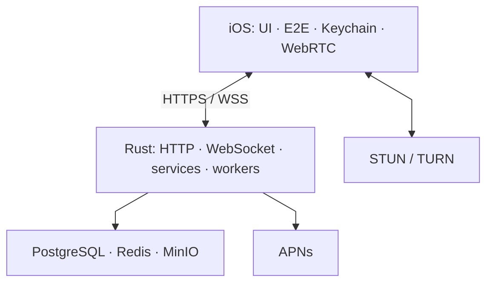

# Architecture

## 1. System scope

TellMe consists of an iOS client and a server-blind backend. The client owns identity and device
keys, session negotiation, payload encryption, and local conversation state. The backend provides
authentication challenges, public prekeys, per-device delivery, realtime notifications, encrypted
media objects, and inter-server delivery.



`HTTPS` carries routing envelopes and ciphertext. `WSS` reports the availability of new objects
but is not the source of conversation history. Labels remain intentionally short so the diagram is
readable on narrow screens; the following sections define each responsibility.

## 2. Trust boundaries

### 2.1 Device

The trusted zone contains:

- the account seed and derived identity keys;
- device signing and DH private keys;
- signed-prekey and one-time-prekey private material;
- ratchet root, chain, and message keys;
- attachment keys and the local decrypted archive.

Long-lived private material is stored through Keychain-backed storage. The backend receives none
of these values during registration or device linking.

### 2.2 Backend

The backend is treated as potentially compromisable. It may observe:

- user handle and home server;
- public account/device keys and signatures;
- public prekeys;
- target device, timestamps, TTL, and delivery identifiers;
- mailbox and media ciphertext;
- minimum push-routing fields.

The backend must not receive message bodies, attachment keys, ratchet state, decrypted call
signaling, or private account/device keys.

### 2.3 External providers

- APNs receives an opaque wake payload and device token. The payload contains no sender handle,
  message text, or call metadata.
- TURN observes transport metadata and IP addresses but does not receive an application-level call
  signaling key.
- S3-compatible storage receives only ciphertext and a server-generated object key.

## 3. iOS client layers

| Layer | Responsibility | Examples |
| --- | --- | --- |
| UI / coordinators | presentation and navigation | `UI/`, `Core/Navigation/` |
| ViewModels | screen state and orchestration | `ViewModels/` |
| Services | authentication, messages, devices, calls | `Services/` |
| Security | primitives and secure persistence | `Security/` |
| Networking | HTTP transport and wire types | `Networking/` |
| Realtime | WebSocket codec and routing | `WebSocket/`, `Core/Realtime/` |
| Local state | session, archive, Core Data | `Core/Session/`, `.xcdatamodeld` |

A view controller must not construct cryptographic payloads directly or perform SQL-like
operations on the local archive. A ViewModel coordinates protocol and service boundaries, while a
storage implementation encapsulates persistence.

## 4. Backend layers

The Rust backend is separated by domain. Most domains use the same dependency direction:

```text
HTTP/WebSocket adapter
        ↓
request/contract validation
        ↓
domain service
        ↓
repository or external transport
```

For example, message delivery crosses a route adapter in `lib.rs`, `message_service.rs`, and
`message_repository.rs`. A repository receives an already normalized request and uses only
parameterized SQL.

`lib.rs` remains the composition root that connects route adapters to persistence-backed services.
This is acknowledged transition debt: new domains should reduce its scope rather than place
independent business logic in the HTTP layer.

## 5. Data stores

### PostgreSQL

Stores accounts, public keys, hashed sessions, mailbox ciphertext, media-object metadata,
federation trust, and worker queues. Migrations execute in fixed order from
`docker/init-scripts/` and are recorded in `schema_migrations`.

### Redis

Coordinates presence and realtime availability. Redis is not the source of truth for message
history or ratchet state.

### MinIO / S3

Stores opaque media ciphertext. PostgreSQL stores only a hash of the download capability; the
client presents the capability when downloading the object.

## 6. Primary flows

### Registration

1. The client creates account and device keys locally.
2. The client signs a canonical registration payload.
3. The backend verifies the signature and creates account and device records.
4. The backend returns session and refresh tokens; only their hashes are stored.

### Message delivery

1. The client retrieves prekey bundles for the recipient's active devices.
2. It creates a separate encrypted delivery for each device.
3. The backend validates the routing envelope without decoding ciphertext.
4. Local delivery writes mailbox blobs; remote delivery creates a federation outbox item.
5. Realtime reports only the availability of new blobs.

### Attachment

1. The client encrypts the file with a fresh media key.
2. The backend creates a media ID and download capability.
3. The client uploads ciphertext with a signed attestation.
4. The backend verifies size, hash, verdict, and stores the ciphertext.
5. The media key and plaintext metadata travel only inside the encrypted message payload.

## 7. Failure handling

- a delivery ID makes mailbox writes idempotent;
- outbox and push workers use claim tokens and retry schedules;
- acknowledgement is separate from blob retrieval;
- TTL bounds the lifetime of undelivered ciphertext;
- graceful shutdown stops HTTP acceptance and terminates the worker scheduler;
- a realtime availability event is not delivery confirmation.

## 8. Architectural debt

- `lib.rs` and several iOS ViewModels/ViewControllers exceed the recommended size;
- the protocol implementation requires independent cryptographic review;
- group messaging is not implemented;
- the single-node production Compose topology must be adapted before horizontal scaling;
- integration coverage with real PostgreSQL, Redis, and MinIO should grow independently of unit
  tests.
