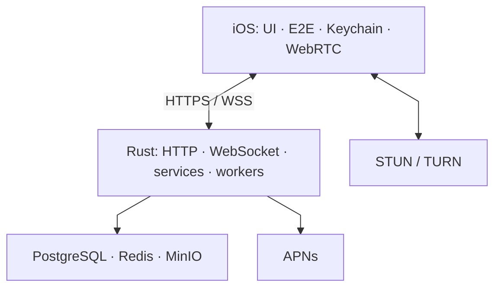

# Архитектура

## 1. Область системы

TellMe состоит из iOS-клиента и server-blind backend. Клиент отвечает за identity/device keys,
согласование сессий, шифрование payload и локальное состояние диалогов. Backend отвечает за
authentication challenge, публичные prekeys, per-device delivery, realtime notification,
зашифрованные media objects и межсерверную доставку.



`HTTPS` переносит routing envelope и ciphertext; `WSS` сообщает о доступности новых объектов, но
не является источником истории. Подписи внутри узлов намеренно краткие: ответственность
компонентов раскрыта в следующих разделах, а схема остаётся читаемой на узком экране.

## 2. Границы доверия

### 2.1 Устройство

Доверенная зона включает:

- account seed и производные identity keys;
- device signing/DH private keys;
- signed/one-time prekey private material;
- ratchet root/chain/message keys;
- ключи вложений и локальный decrypted archive.

Долгоживущий private material сохраняется через Keychain-backed storage. Backend не получает эти
значения ни при регистрации, ни при linking.

### 2.2 Backend

Backend считается потенциально компрометируемым. Ему разрешено видеть:

- user handle и home server;
- public identity/device keys и подписи;
- public prekeys;
- device target, timestamps, TTL и delivery identifiers;
- ciphertext mailbox/media objects;
- минимальные push routing fields.

Backend не должен получать message body, attachment key, ratchet state, decrypted call signaling и
private identity/device key.

### 2.3 Внешние провайдеры

- APNs получает opaque wake payload и device token. Payload не содержит sender handle, message text
  или call metadata.
- TURN видит transport metadata и IP-адреса, но не получает application-level call signaling key.
- S3-compatible storage получает только ciphertext и server-generated object key.

## 3. Слои iOS-клиента

| Слой | Ответственность | Примеры |
| --- | --- | --- |
| UI / coordinators | presentation и navigation | `UI/`, `Core/Navigation/` |
| ViewModels | состояние экрана и orchestration | `ViewModels/` |
| Services | auth, messages, devices, calls | `Services/` |
| Security | primitives и secure persistence | `Security/` |
| Networking | HTTP transport и wire types | `Networking/` |
| Realtime | WebSocket codec и routing | `WebSocket/`, `Core/Realtime/` |
| Local state | session, archive, Core Data | `Core/Session/`, `.xcdatamodeld` |

View controller не должен напрямую формировать криптографический payload или выполнять SQL-like
операцию над локальным archive. ViewModel координирует protocol/service boundaries, а storage
реализация инкапсулирует persistence.

## 4. Слои backend

Rust backend разделён по доменам. Для большинства доменов применяется одинаковая схема:

```text
HTTP/WebSocket adapter
        ↓
request/contract validation
        ↓
domain service
        ↓
repository or external transport
```

Например, message delivery проходит через route adapter в `lib.rs`, `message_service.rs` и
`message_repository.rs`. Repository принимает уже нормализованный запрос и использует только
параметризованный SQL.

`lib.rs` остаётся composition root и связывает route adapters с persistence-backed services. Это
осознанный переходный долг: новые домены должны уменьшать его объём, а не добавлять независимую
бизнес-логику в HTTP layer.

## 5. Хранилища

### PostgreSQL

Хранит аккаунты, публичные ключи, sessions в хешированном виде, mailbox ciphertext, metadata media
objects, federation trust и worker queues. Миграции применяются в фиксированном порядке из
`docker/init-scripts/` и регистрируются в `schema_migrations`.

### Redis

Используется для presence/realtime coordination. Redis не является источником истины для message
history или ratchet state.

### MinIO / S3

Хранит opaque media ciphertext. Download capability сохраняется в PostgreSQL только как hash;
клиент передаёт capability при загрузке объекта.

## 6. Основные потоки

### Регистрация

1. Клиент создаёт account/device keys локально.
2. Клиент подписывает canonical registration payload.
3. Backend проверяет подпись и создаёт account/device records.
4. Backend возвращает session и refresh tokens; в базе сохраняются их hashes.

### Доставка сообщения

1. Клиент получает prekey bundle активных устройств получателя.
2. Для каждого устройства создаётся отдельный encrypted delivery.
3. Backend валидирует routing envelope, не декодируя ciphertext.
4. Локальная доставка пишет mailbox blobs; remote delivery формирует federation outbox.
5. Realtime сообщает только о наличии новых blobs.

### Вложение

1. Клиент шифрует файл свежим media key.
2. Backend создаёт media id и download capability.
3. Клиент загружает ciphertext с signed attestation.
4. Backend проверяет размер/hash/verdict и сохраняет ciphertext.
5. Media key и plaintext metadata передаются только внутри encrypted message payload.

## 7. Отказоустойчивость

- delivery id делает запись mailbox идемпотентной;
- outbox/push workers используют claim token и retry schedule;
- acknowledgement отделён от получения blob;
- TTL ограничивает срок жизни недоставленных ciphertext;
- graceful shutdown прекращает HTTP accept и завершает worker scheduler;
- realtime availability event не является подтверждением доставки.

## 8. Архитектурный долг

- `lib.rs` и несколько iOS ViewModel/ViewController превышают рекомендуемый размер;
- protocol implementation требует независимой криптографической проверки;
- group messaging отсутствует;
- одноузловой production Compose требует адаптации перед горизонтальным масштабированием;
- integration tests с реальными PostgreSQL/Redis/MinIO должны расширяться независимо от unit tests.
